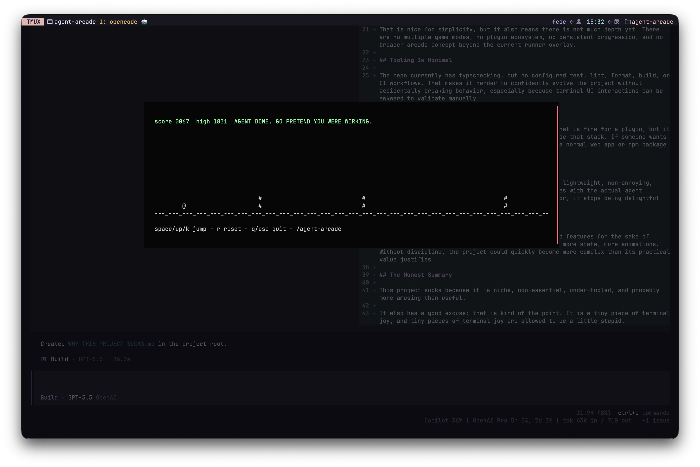

# Agent Arcade for OpenCode

[](https://www.npmjs.com/package/opencode-agent-arcade)
[](./LICENSE)
[](https://opencode.ai)

Agent Arcade is an experimental OpenCode TUI plugin that turns agent wait time into tiny terminal arcade games.

Open it while the agent works, play a quick game, watch tool events fly through the overlay, and approve pending permissions without leaving the game.



## Games

- Runner: jump over terminal gremlins while agent events become in-game floaters.
- Tetris: stack pieces while waiting for the agent to finish.

The overlay includes a native game selector, so `/agent-arcade` and `ctrl+shift+g` can open a game or close the active overlay.

## Install

Add the plugin to your OpenCode TUI config at `.opencode/tui.json`:

```json
{
  "$schema": "https://opencode.ai/tui.json",
  "plugin": ["opencode-agent-arcade"]
}
```

Then restart OpenCode. TUI plugins are loaded when OpenCode starts.

Optional auto-start opens the last selected game when an agent becomes busy:

```json
{
  "$schema": "https://opencode.ai/tui.json",
  "plugin": [["opencode-agent-arcade", { "autoStart": true }]]
}
```

You can also choose a specific auto-start game or randomize it:

```json
{
  "$schema": "https://opencode.ai/tui.json",
  "plugin": [["opencode-agent-arcade", { "autoStart": true, "autoStartGame": "random" }]]
}
```

`autoStartGame` accepts `last`, `runner`, `tetris`, or `random`.

## Usage

- `/agent-arcade`: open the game selector, or close the active game overlay.
- `/agent-arcade-auto`: toggle auto-start and persist it locally.
- `ctrl+shift+g`: open the game selector, or close the active game overlay.
- Game selector: use arrows to navigate, `enter` to select, and `esc` to close.

Runner controls:

- `space`, `up`, or `k`: jump.
- `r`: reset after game over.
- `m`: return to the game selector.
- `q` or `esc`: quit the overlay.
- `a`: approve the currently pending OpenCode permission once.

Tetris controls:

- `left` or `h`: move left.
- `right` or `l`: move right.
- `down` or `j`: soft drop.
- `up`, `k`, or `space`: rotate.
- `c`: hold the current piece.
- `d`: hard drop.
- `p`: pause or resume.
- `r`: reset.
- `m`: return to the game selector.
- `q` or `esc`: quit.
- `a`: approve the currently pending OpenCode permission once.

The `a` binding only replies to an active OpenCode permission prompt with `once`. Review what the agent is asking for before approving.

## Local Development

This repo uses Bun and publishes the TUI plugin source directly.

```sh
bun install
bun run typecheck
```

For local OpenCode usage from this repo, `.opencode/tui.json` points at `packages/opencode-plugin/src/tui.tsx`.

## Package Entry

The npm package exports the TUI plugin through `./tui`:

```json
{
  "exports": {
    ".": "./src/tui.tsx",
    "./tui": "./src/tui.tsx"
  }
}
```

OpenCode resolves npm TUI plugins through that `./tui` export.

## Status

This is an alpha plugin. It is ready for people to try, but expect rough edges while OpenCode's TUI plugin surface keeps evolving.

Queue goblin note: agent signals line up in a tiny 12-message arcade queue before the game eats them.

Palette gremlin fact: `/agent-arcade` and `ctrl+shift+g` summon the same tiny waiting-room cabinet.

## Links

- npm: https://www.npmjs.com/package/opencode-agent-arcade
- GitHub issues: https://github.com/fedeya/agent-arcade/issues
